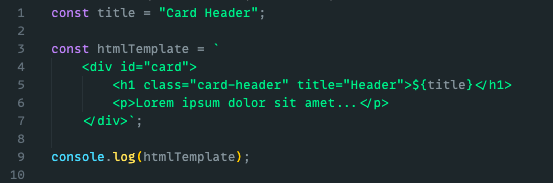
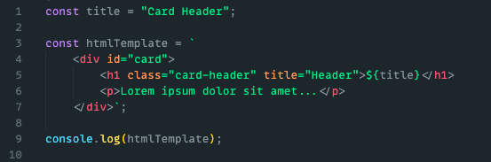

# HTML highlighting for JS

This extension enables syntax highlighting for template strings (\`\`). It is fully compatible with all of your favorite color schemes too!

## Features

| **Before:** Without this Extension | **After:** With this Extension |
| ---------------------------------- | ------------------------------ |
|      |    |

> Tip: This works with your preferred color scheme!

## Usage

1. Just install this extension. (And reload if required)
2. Open a JavaScript file
3. In the statusbar (on the bottom right), click the Language Button (Should show: `JavaScript`)
4. Click `Configure File Association for '.js'`
5. Select `Javascript (\w HTML templating)`

## Other

- [Want to add a feature (contribute)?](https://github.com/Throvn/js-html-template-strings/issues)
- [Want to file an issue?](https://github.com/Throvn/js-html-template-strings/issues)

**Enjoy!**
